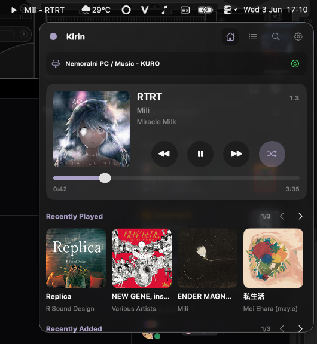

# Kirin

Kirin is a macOS 13+ menu bar music client for Plex, Navidrome, and local files. It keeps playback, queue management, and library browsing inside a compact menu bar popup, so music controls stay close without opening a full desktop app.

## Demo



<!-- Add screenshots or short captures to `demo/` as the app evolves.

Suggested captures:

- `demo/menu-bar-popup.png` - main popup with now-playing controls
- `demo/local-queue.png` - local file queue with imported tracks
- `demo/settings.png` - settings view with source and appearance controls
- `demo/plex-home.png` - Plex home/library view
- `demo/navidrome-login.png` - Navidrome connection flow -->

## Features

- Native macOS menu bar app built with SwiftUI `MenuBarExtra`.
- Source modes for Plex, Navidrome, and local audio files.
- AVPlayer-backed playback with play, pause, seek, previous, and next controls.
- Queue editing with remove, reorder, clear-upcoming, and shuffle controls.
- Local file import from the app using a multi-select audio picker.
- Local metadata loading from supported files, including title, artist, album, duration, and embedded artwork when available.
- Plex external-browser PIN authentication with Keychain-backed token storage.
- Plex server and music-library discovery with persisted selection.
- Plex home content, recently played albums, recently added albums, playlists, and stations.
- Plex server-managed play queues with Play Next, Add to Queue, refresh, reorder, remove, clear-upcoming, and shuffle.
- Navidrome connection support through the Subsonic API.
- Configurable menu bar status text.
- System, Light, and Dark appearance preferences.
- Optional loudness leveling for supported server-backed tracks.
- Timeline reporting and listened tracking for server-backed playback.

## Source Modes

### Local Files

Local mode is queue-first. Choose audio files from the app, and Kirin replaces the current local playlist with those tracks, selects the first item, and starts playback. Local mode focuses on the play queue and settings instead of showing a home screen or library browser.

Current local-file support includes:

- Multi-file import from `NSOpenPanel`
- Basic metadata and embedded artwork extraction with `AVURLAsset`
- Local queue playback and editing without network calls
- Queue and Settings tabs only
- Session-only local queues

Finder "Open With Kirin" support is planned, but not shipped yet.

### Plex

Plex mode provides the fuller library experience. After signing in through the Plex browser auth flow, Kirin discovers servers and music libraries, loads home content, and plays tracks through Plex-backed queues.

Plex mode includes:

- PIN auth and Keychain token persistence
- Server and library selection
- Recently played and recently added album sections
- Playlist and station playback
- Server-managed queue synchronization
- Playback timeline reporting and listened tracking
- Optional loudness leveling from Plex analysis data

### Navidrome

Navidrome support uses the Subsonic API and shares the same media-service layer as the rest of the app. It can be selected as a source alongside Plex and local files, with credentials stored separately from Plex.

## Interface

The popup adapts to the selected source:

- Server-backed sources show library/home content, queue, search, and settings where available.
- Local mode shows only Queue and Settings.
- The Now Playing card stays centered around album art, track metadata, transport controls, and playback progress.

The menu bar status line uses this format:

```text
<icon> <first string> - <next string>
```

Available metadata fields:

- Album Artist
- Track Artist
- Track Name
- Album Name

Settings persist in `UserDefaults`, while service credentials are stored in Keychain.

## Requirements

- macOS 13 or newer
- Swift toolchain compatible with the package
- Plex account and music server for Plex mode
- Navidrome/Subsonic-compatible server for Navidrome mode
- Local audio files for local mode

## Run

```bash
swift build
swift run Kirin
```

## Release

Build a drag-and-drop `.app` and `.dmg` locally:

```bash
./scripts/release-dmg.sh
```

Optional environment variables:

- `VERSION=0.1.0`
- `BUILD_NUMBER=1`
- `BUNDLE_ID=com.yourcompany.Kirin`
- `SIGNING_IDENTITY="Developer ID Application: Your Name (TEAMID)"`
- `NOTARY_PROFILE=AC_NOTARY`

## Project Notes

The project is moving from a Plex-only menu bar client toward a source-neutral music player. The current architecture uses shared media models and service protocols so Plex, Navidrome, and local files can share queue and playback behavior while keeping source-specific network and metadata logic at the service edges.
